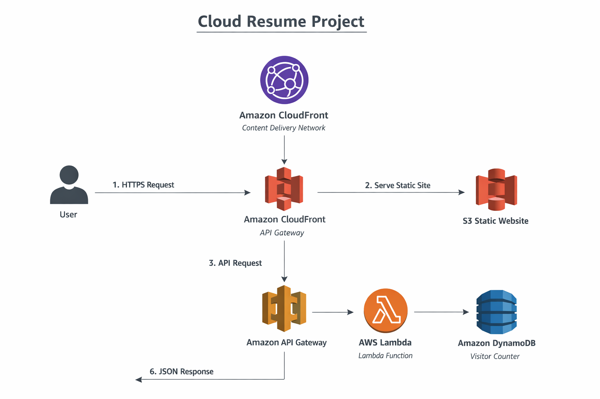

# Cloud Resume Project

This project is a fully serverless, cloud-hosted resume built on AWS. It demonstrates end-to-end cloud engineering capabilities, including frontend hosting, backend development, API integration, and Infrastructure as Code using Terraform.

---

## Architecture

The application uses a serverless architecture:

User → CloudFront → S3 (Frontend)  
User → API Gateway → Lambda → DynamoDB (Visitor Counter)

- Static assets are served globally via CloudFront
- Backend logic is handled through API Gateway and Lambda
- Visitor data is persisted in DynamoDB

---

## AWS Services

- S3 — Static website hosting
- CloudFront — Global CDN and HTTPS delivery
- Route 53 — Domain and DNS management
- ACM — SSL/TLS certificate provisioning
- API Gateway — Public API endpoint for backend communication
- Lambda — Serverless compute for visitor counter logic
- DynamoDB — NoSQL database for tracking visits
- IAM — Fine-grained access control and security

---

## Visitor Counter

The visitor counter is implemented using a serverless backend:

- API Gateway exposes a public HTTP endpoint
- Lambda retrieves and increments a value stored in DynamoDB
- The updated count is returned as a JSON response
- Frontend JavaScript dynamically updates the displayed value

---

## Infrastructure as Code

All AWS resources are managed using Terraform:

- Infrastructure is defined declaratively in `.tf` files
- Resources are version-controlled and reproducible
- Terraform is used to provision and update:
  - Lambda functions
  - DynamoDB tables
  - IAM roles and policies
  - API Gateway configuration

This ensures consistent deployments and eliminates configuration drift.

---

## Live Demo

https://resume.brandon-tucker.com/

---

## Architecture Diagram

## Future Improvements

- Implement CI/CD pipeline for automated deployments
- Add monitoring and logging via CloudWatch
- Improve frontend design and responsiveness